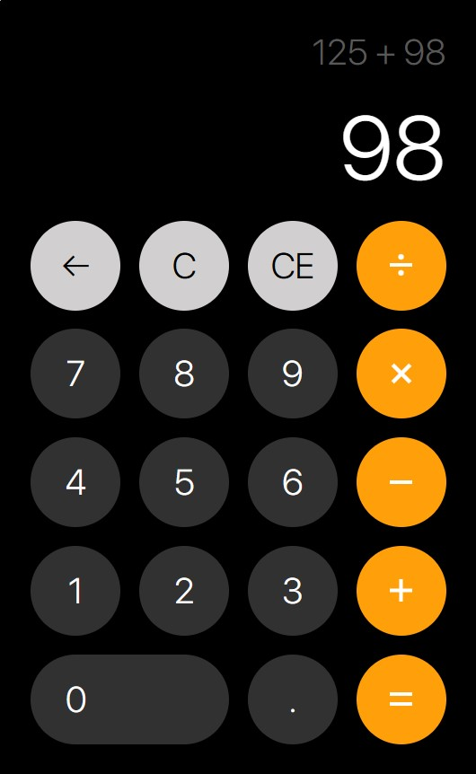

# Apple Basic Calculator Clone

Este proyecto es un clon de la calculadora básica del sistema operativo de apple, desarrollada en React, permite realizar operaciones matemáticas básicas y ofrece una experiencia de usuario fluida con soporte para clics y entrada desde el teclado, se realizaron ciertas modificaciones con respecto a la calculadora original, este clon muestra las operaciones del usuario y sus inputs en tiempo real mediante hooks en react. El funcionamiento de la calculadora es el mismo, el manejo de las operaciones se hizo con base a la respuesta de la calculadora de IOS en el como se manejan las operaciones

## 📌 Características principales

### Operaciones matemáticas básicas:
- `Suma`
- `Resta`
- `Multiplicación`
- `División`

### Botones auxiliares:

- `C` Borra todo el contenido de la calculadora
- `CE` Borra el número actual en el display
- `←` Elimina el último dígito ingresado

Control de errores: Manejo de errores como divisiones entre cero o entradas inválidas serán siempre colocador como "Error".
Audio interactivo: Sonido al presionar botones.

## 📖 Uso

Es posible ingresar números y operadores mediante clics o usando el teclado.

- Presiona "=" o "Enter" para calcular el resultado.
- Utiliza `C`, `CE` o `←` para limpiar el contenido o ajustar entradas.

La calculadora realiza las operaciones siempre y cuando le sea posible, es decir que no necesariamente se necesita presionar "=" para obtener el resultado de una operación, si la calculadora detecta que existe una operacion válida con el formato (num1, operador, num2) es válida, entonces hara la operación y la mostrara en pantalla y estra lista para seguir realizando más operaciones

## ⚙️ Operaciones en tiempo real

Se ha realizado una implementacion de la expresion de las operaciones en tiempo real mediante hooks, es decir que el usuario podrá ver cada botón pulsado en el display, tanto números como operadores, los demas botones realizaran / ejecutaran sus funciones respectivamente y no mostraran una confirmación / input al usuario, más que su función original (por ejemplo, "C" eliminará todas las expresiones, "←" eliminará el último número presionado, etc.). También han sido validados varios casos en caso de que el usuario cometa errores, esto con el fin de corregir la expresion y que el usuario pueda seguir realizando operaciones.

## 🔍 Ejemplos de casos de errores del usuario
- ¿Que pasaría si el usuario presiona un operador y después presiona el boton ""? La operacion no puede realizarse porque no hay un número después del operador
- Solución: Eliminar el operador de la expresión, conservando el primer número y esperar la respeusta del usuario para que presione un operador y un nuevo número
- ¿Que pasaría si el usuario presiona "=" sin antes presionar un operador?
- Solución: El número en el display pasa a ser el primer número de la expresión
- ¿Que pasaría si el usuario intenta colocar más de un punto decimal?
- Solución: Se valida la expresión en cada input, por lo que si existe más de un punto simplemente no se permite la entrada a menos que sea un número u operador, u cualquier otra acción posible
- ¿Que pasaría si el usuario presiona dos operadores de forma seguida?
- Solución: El operador en la expresión se actualiza al más reciente, hasta que el usuario presione un número para realizar una operación

Sí existen casos que no pueden ser validados o resueltos, en su caso, la divisón entre 0 es un error que arroja como resultado "Error" en este proyecto, la lógica para responder a dicho problema consiste en reiniciar el display y la expresion al presionar cualquier botón, si por ejemplo el usuario intenta realizar la operacion: "Error + " el display se reinicia dejandolo en 0 para realizar una nueva operación. 

 

### 🚀 Deployment
https://basic-apple-calculator-clone.vercel.app/

 

# Getting Started with Create React App

## Available Scripts

### `npm start`

Runs the app in the development mode.\
Open [http://localhost:3000](http://localhost:3000) to view it in your browser.

### `npm test`

Launches the test runner in the interactive watch mode.\
See the section about [running tests](https://facebook.github.io/create-react-app/docs/running-tests) for more information.

### `npm run build`

Builds the app for production to the `build` folder.\
It correctly bundles React in production mode and optimizes the build for the best performance.

See the section about [deployment](https://facebook.github.io/create-react-app/docs/deployment) for more information.

### `npm run eject`

**Note: this is a one-way operation. Once you `eject`, you can't go back!**

If you aren't satisfied with the build tool and configuration choices, you can `eject` at any time. This command will remove the single build dependency from your project.

Instead, it will copy all the configuration files and the transitive dependencies (webpack, Babel, ESLint, etc) right into your project so you have full control over them. All of the commands except `eject` will still work, but they will point to the copied scripts so you can tweak them. At this point you're on your own.
